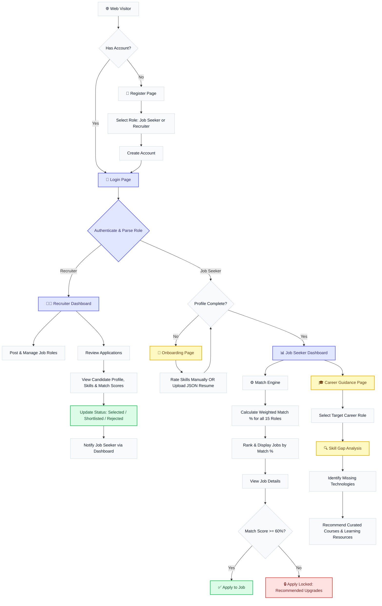

# CareerPath (Teamtide) — Skill-Based Job Matching & Career Guidance Portal

CareerPath is an AI-powered, full-stack web application designed to connect job seekers with suitable employment opportunities based on their technical skills, soft skills, and professional interests. 

Unlike traditional job boards that rely solely on keyword searches, CareerPath analyzes the user's skill profile, extracts skills from uploaded resumes, calculates match percentages against real-world job requirements, and provides actionable career guidance to bridge skill gaps.

---

## 📊 Complete Project Flowchart

This flowchart illustrates the user journey, system logic, and workflows for both **Job Seekers** and **Recruiters** on the CareerPath platform.



---

## 🌟 Key Features

### 1. Smart Skill-Based Job Matching
- Ranks job opportunities dynamically based on a weighted skill-match algorithm.
- Calculates a percentage-based match score for every job against the user's profile.
- Restricts applicants from applying to jobs where their skill set matches less than the **60% eligibility threshold**, encouraging upskilling.

### 2. Automated Resume Parsing & Merge
- Supports uploading a JSON resume to automatically extract skills using robust keyword and alias matching (e.g., mapping `"js"` or `"reactjs"` to `"React"` and `"JavaScript"`).
- Merges parsed skills directly into the user's active profile, saving onboarding time.

### 3. Career Guidance & Skill Gap Analysis
- Select a target role from 15 industry-standard careers to view required skills vs. your current skills.
- Identifies exactly which skills you need to learn or improve to reach the 60% matching threshold.
- Recommends specific courses and development roadmaps for any missing technologies.

### 4. Recruiter Administration
- A dedicated Dashboard for recruiters to track applicants.
- Detailed metrics showing overall match percentages, candidate profiles, and resume metadata.
- Ability to update candidate application status (Pending, Under Review, Shortlisted, Selected, Rejected).

---

## 🛠️ Technology Stack

- **Frontend**: React.js, Vite, Vanilla CSS
- **Backend**: Python, FastAPI
- **Database**: MongoDB Cloud Atlas (Motor Asyncio ODM)
- **Authentication**: JWT (JSON Web Tokens), bcrypt password hashing
- **Hosting**:
  - Frontend: Vercel (Static Web Server with API Reverse Proxy)
  - Backend: Render (Persistent Web Service)

---

## 💼 Curated Job Roles & Skill Requirements

The system includes a database of 15 exact industry roles and their required skill sets to provide accurate matching and career guidance:

| ID | Job Role | Required Skills |
|:---|:---|:---|
| 1 | **Software Developer** | Java, Python, C++, OOP, Git, SQL |
| 2 | **Full Stack Developer** | HTML, CSS, JavaScript, React, Node.js, MongoDB |
| 3 | **Frontend Developer** | HTML, CSS, JavaScript, React, Bootstrap |
| 4 | **Backend Developer** | Java, Spring Boot, Node.js, Django, REST APIs, SQL |
| 5 | **Data Analyst** | Excel, SQL, Python, Power BI, Tableau, Statistics |
| 6 | **Data Scientist** | Python, Machine Learning, Pandas, NumPy, TensorFlow, SQL |
| 7 | **AI/ML Engineer** | Python, Deep Learning, TensorFlow, PyTorch, NLP, Computer Vision |
| 8 | **Cybersecurity Analyst** | Network Security, Ethical Hacking, Kali Linux, SIEM, Firewalls |
| 9 | **Cloud Engineer** | AWS, Azure, GCP, Docker, Kubernetes, Linux |
| 10 | **DevOps Engineer** | Docker, Kubernetes, Jenkins, Git, CI/CD, Linux |
| 11 | **Mobile App Developer** | Flutter, Kotlin, Java, Swift, Firebase |
| 12 | **UI/UX Designer** | Figma, Adobe XD, Wireframing, Prototyping, User Research |
| 13 | **Database Administrator (DBA)** | MySQL, PostgreSQL, Oracle, SQL Server, Database Optimization |
| 14 | **QA/Test Engineer** | Selenium, JUnit, Manual Testing, API Testing, TestNG |
| 15 | **Business Analyst** | SQL, Excel, Power BI, Requirements Gathering, Agile, Communication |

---

## ⚙️ Match Score Algorithm

The match percentage is calculated dynamically based on required skill weightings:
$$\text{Match \%} = \frac{\sum (\text{Required Skill Weight} \times \text{User Skill Level Factor})}{\sum \text{Required Skill Weight}} \times 100$$

- **User Skill Level Factor**: A score between `0.0` and `1.0` depending on the user's rated level (1 to 5) for that skill.
- **Minimum Apply Threshold**: Candidates must score $\ge 60\%$ to unlock the "Apply" button.

---

## 📡 API Reference

### Authentication
- `POST /api/auth/register` — Create a new seeker or recruiter account.
- `POST /api/auth/login` — Sign in and receive a JWT token.
- `GET /api/auth/me` — Verify token and fetch profile details.

### Profile & Skills
- `GET /api/profile` — Fetch active profile.
- `PUT /api/profile/info` — Update profile metadata (bio, target role, education, etc.).
- `PUT /api/profile/skills` — Save manual skill ratings.
- `POST /api/profile/resume` — Upload JSON resume for parsing and skill merging.

### Jobs & Applications
- `GET /api/jobs` — Retrieve curated jobs (ranked dynamically for the user).
- `GET /api/applications` — Get user application history or candidates list (for recruiters).
- `POST /api/applications` — Submit a new job application.
- `PUT /api/applications/:id/status` — Recruiter update candidate application status.

---

## 🚀 Setup & Installation Instructions

### 1. Prerequisites
- Node.js (v18+)
- Python (3.9+)
- MongoDB Atlas Account

### 2. Backend Setup
1. Open a terminal and navigate to the project root:
   ```bash
   python -m venv venv
   source venv/bin/activate  # On Windows: venv\Scripts\activate
   pip install -r api/requirements.txt
   ```
2. Create a `.env` file in the root directory:
   ```env
   MONGODB_URI=your_mongodb_connection_string
   JWT_SECRET=your_super_secret_key
   PORT=5000
   ```
3. Run the FastAPI server:
   ```bash
   python app.py
   ```

### 3. Frontend Setup
1. Open a new terminal and navigate to the `client` folder:
   ```bash
   cd client
   npm install
   npm run dev
   ```

---

## ☁️ Deployment Reference

### Render (Backend API)
1. Set up a new **Web Service** pointing to your repository.
2. Build Command: `bash build.sh`
3. Start Command: `uvicorn app:app --host 0.0.0.0 --port 10000`
4. Add environment variables: `MONGODB_URI` and `JWT_SECRET`.

### Vercel (Frontend Client)
1. Deploy a new project and select the `client` folder as the **Root Directory**.
2. Framework Preset: **Vite**.
3. All requests to `/api` and `/uploads` will automatically route to the Render URL as defined in the [client/vercel.json](file:///c:/Users/Nithish/OneDrive/Documents/Skill%20based%20job%20mataching%20-%20Copy/client/vercel.json) rewrite file.
