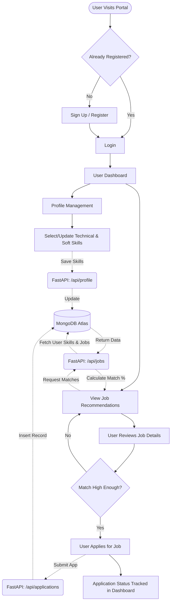

# CareerPath — Skill-Based Job Matching Portal

Project Overview

CareerPath is an intelligent, skill-based career guidance and job matching platform designed to connect job seekers with relevant employment opportunities based on their competencies rather than traditional keyword-based searches. By leveraging a skill-centric recommendation system, the platform identifies the most suitable job openings that align with a user's technical expertise and professional capabilities, enabling more accurate and meaningful career opportunities.

The application follows a modern full-stack architecture, featuring a React.js frontend for an interactive user experience, a FastAPI backend for high-performance API services, and MongoDB Atlas as the cloud-based NoSQL database for scalable and flexible data management.
---

## 📖 Detailed System Workflow

The platform operates on a streamlined, user-friendly workflow divided into several core stages:

### 1. User Authentication & Onboarding
* **Sign Up / Registration**: New users create an account providing their basic details (name, email, password). Passwords are securely hashed using `bcrypt` before being stored in the database.
* **Login**: Returning users authenticate their credentials. The backend verifies the password hash and issues a secure **JSON Web Token (JWT)**, which the frontend stores (usually in local storage or a secure cookie) to maintain the user's session.

### 2. Profile & Skill Management
* **Dashboard Access**: Upon successful login, users are redirected to their personalized dashboard.
* **Skill Selection**: This is the core of the platform. Users are presented with categorized lists of skills (e.g., *Programming Languages*, *Frontend Development*, *Backend Development*, *Cloud & DevOps*, *Data Science & AI*, and *Soft Skills*).
* **Updating Profile**: Users select all the skills they possess. This data is instantly synced with their profile in the MongoDB database via the backend API.

### 3. The Matching Engine
* **Job Aggregation**: The database contains a collection of job postings, each tagged with its own set of "Required Skills".
* **Skill-Based Matching Algorithm**: When a user visits the "Jobs" or "Recommendations" section, the FastAPI backend compares the user's saved skills against the required skills for all active job postings.
* **Scoring & Sorting**: Jobs are scored based on the percentage match (e.g., if a user has 4 out of 5 required skills for a job, it's an 80% match). Jobs are then returned to the frontend sorted from highest match percentage to lowest.

### 4. Application & Tracking
* **Job Discovery**: Users see a tailored feed of jobs that actually fit their capabilities, avoiding the noise of irrelevant listings.
* **Applying**: Users can click on a job to view detailed descriptions, salary ranges, and company info. By clicking "Apply", an application record is created linking the user's ID to the job's ID.
* **Application Status**: The user's dashboard contains an "Applications" tab where they can track the status of all jobs they have applied for (e.g., *Pending*, *Reviewed*, *Interview Scheduled*, *Rejected*).

---

## 🔄 System Flowchart

The following flowchart illustrates the complete user journey and data flow:



---

## 🏗️ Architecture & Tech Stack

### Frontend (Client)
* **React.js**: For building a dynamic, Single Page Application (SPA).
* **Vite**: Used as the frontend build tool for incredibly fast Hot Module Replacement (HMR).
* **Styling**: Built with modern CSS (and likely Tailwind CSS or a UI library) for a responsive, premium aesthetic.

### Backend (Server)
* **FastAPI (Python)**: A modern, fast (high-performance) web framework for building APIs. Chosen for its automatic Swagger documentation, data validation with Pydantic, and async support.
* **Motor**: The asynchronous Python driver for MongoDB, allowing non-blocking database queries.
* **Passlib & Python-Jose**: For robust password hashing (`bcrypt`) and JWT generation/validation.

### Database
* **MongoDB Cloud Atlas**: A NoSQL document database. Ideal for this project due to the flexible nature of job listings, user profiles, and array-based skill tags.

---

## 📡 Core API Structure

The backend exposes several RESTful endpoints (documented automatically via Swagger at `http://localhost:5000/docs` when running):

* `POST /api/auth/register` - Creates a new user account.
* `POST /api/auth/login` - Authenticates user and returns a JWT.
* `GET /api/profile` - Fetches the authenticated user's profile and selected skills.
* `PUT /api/profile/skills` - Updates the user's skill array.
* `GET /api/jobs` - Retrieves job listings (optionally filtered and sorted by match percentage).
* `POST /api/applications` - Submits a job application for the authenticated user.
* `GET /api/applications` - Retrieves a user's application history.

---

## 🚀 Setup & Local Development

To run this project locally on your machine:

1. **Clone the repository** to your local machine.
2. **Environment Variables**: Create a `.env` file in the root directory. You will need to define:
   ```env
   MONGO_URI=your_mongodb_cloud_connection_string
   JWT_SECRET=a_secure_random_secret_string
   PORT=5000
   ```
3. **Install Dependencies**: The project uses a unified package script. Run the following command in the root directory to install both frontend (Node/React) and backend (Python) dependencies:
   ```bash
   npm run install:all
   ```
4. **Start the Development Server**:
   ```bash
   npm run dev
   ```
   *Note: This command concurrently starts the FastAPI backend (usually on port 5000) and the React frontend (usually on port 5173).*
