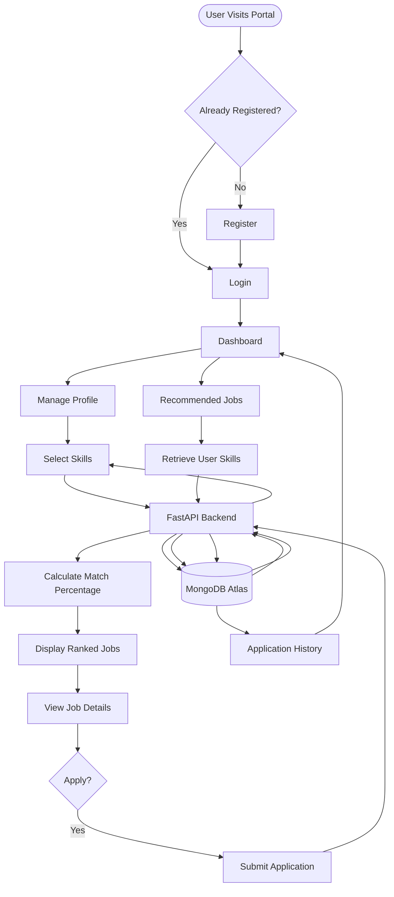

# 🚀 CareerPath – Skill-Based Job Matching Portal

CareerPath is an intelligent **Skill-Based Job Matching and Career Guidance Platform** that connects job seekers with relevant employment opportunities based on their technical and professional skills rather than traditional keyword-based searching.

The platform analyzes a user's skill set, compares it with employer requirements, calculates a matching percentage, and recommends the most suitable job opportunities. This enables users to discover careers aligned with their competencies while helping employers identify qualified candidates more efficiently.

---

# 📌 Table of Contents

* [Project Overview](#-project-overview)
* [Features](#-features)
* [Technology Stack](#-technology-stack)
* [System Workflow](#-system-workflow)
* [System Flowchart](#-system-flowchart)
* [REST API Endpoints](#-rest-api-endpoints)
* [Project Structure](#-project-structure)
* [Installation](#-installation)
* [Running the Project](#-running-the-project)
* [Future Enhancements](#-future-enhancements)
* [Contributing](#-contributing)
* [License](#-license)

---

# 📖 Project Overview

CareerPath is a modern full-stack web application that bridges the gap between job seekers and employers using an intelligent skill-based recommendation system.

Unlike traditional job portals that rely primarily on keyword searches, CareerPath focuses on the user's actual skills and competencies. By comparing user profiles with employer-defined job requirements, the platform generates personalized job recommendations ranked by skill match percentage.

The application provides a seamless experience from user registration to job application tracking while maintaining secure authentication and efficient data management.

---

# ✨ Features

## 👤 User Authentication

* Secure user registration
* Password encryption using **bcrypt**
* JWT-based authentication
* Protected API endpoints
* Persistent user sessions

---

## 👨‍💻 User Profile Management

* Personalized dashboard
* Edit profile information
* Add or update skills
* Categorized skill selection
* Real-time profile synchronization

---

## 🎯 Intelligent Skill-Based Job Matching

* Percentage-based matching algorithm
* Personalized recommendations
* Ranked job listings
* Fast recommendation engine
* Relevant job discovery

---

## 💼 Job Management

* View detailed job descriptions
* Company information
* Salary range
* Required skills
* Employment type
* Location details

---

## 📄 Job Applications

* One-click application
* Track application history
* View application status
* Dashboard integration

Application statuses include:

* Pending
* Under Review
* Shortlisted
* Interview Scheduled
* Selected
* Rejected

---

# 🛠 Technology Stack

| Layer           | Technology              |
| --------------- | ----------------------- |
| Frontend        | React.js                |
| Styling         | HTML5, CSS3, JavaScript |
| Backend         | FastAPI                 |
| Language        | Python                  |
| Database        | MongoDB Atlas           |
| Authentication  | JWT, bcrypt             |
| API             | REST API                |
| Version Control | Git & GitHub            |

---

# 🔄 System Workflow

## 1. User Registration

* User creates an account.
* Password is encrypted using bcrypt.
* User data is stored securely in MongoDB Atlas.

---

## 2. User Login

* User enters email and password.
* Backend validates credentials.
* JWT token is generated.
* User is redirected to the dashboard.

---

## 3. Profile Management

Users can manage:

* Personal details
* Technical skills
* Soft skills

Available skill categories include:

* Programming Languages
* Frontend Development
* Backend Development
* Database Technologies
* Cloud & DevOps
* Data Science & AI
* Mobile Development
* Soft Skills

---

## 4. Skill-Based Job Matching

Whenever a user opens the **Recommended Jobs** page:

1. Backend fetches the user's skills.
2. Retrieves available jobs.
3. Compares required skills.
4. Calculates matching percentage.
5. Sorts jobs by highest match.

Example:

Required Skills

* Python
* React
* MongoDB
* Git
* REST API

User Skills

* Python
* React
* MongoDB
* Git

Match Percentage

```
(4 / 5) × 100 = 80%
```

The jobs are then ranked from highest to lowest match percentage.

---

## 5. Job Application

The user can

* View job details
* Apply for jobs
* Save application history

---

## 6. Application Tracking

Users can monitor:

* Pending
* Reviewed
* Shortlisted
* Interview Scheduled
* Selected
* Rejected

through the dashboard.

---

# 🔄 System Flowchart



---

# 📡 REST API Endpoints

| Method | Endpoint              | Description                  |
| ------ | --------------------- | ---------------------------- |
| POST   | `/api/auth/register`  | Register a new user          |
| POST   | `/api/auth/login`     | User authentication          |
| GET    | `/api/profile`        | Get user profile             |
| PUT    | `/api/profile/skills` | Update user skills           |
| GET    | `/api/jobs`           | Retrieve job recommendations |
| POST   | `/api/applications`   | Apply for a job              |
| GET    | `/api/applications`   | View application history     |

Swagger Documentation

```
http://localhost:5000/docs
```

---

# 📂 Project Structure

```
CareerPath
│
├── frontend
│   ├── src
│   ├── public
│   ├── package.json
│   └── vite.config.js
│
├── backend
│   ├── models
│   ├── routes
│   ├── database
│   ├── utils
│   ├── main.py
│   └── requirements.txt
│
├── README.md
└── .env
```

---

# ⚙ Installation

Clone the repository

```bash
git clone https://github.com/your-username/CareerPath.git

cd CareerPath
```

---

Install Frontend Dependencies

```bash
cd frontend

npm install
```

---

Install Backend Dependencies

```bash
cd backend

pip install -r requirements.txt
```

---

Create Environment Variables

Create a `.env` file.

```env
MONGO_URI=your_mongodb_connection_string

JWT_SECRET=your_secret_key

PORT=5000
```

---

# ▶ Running the Project

Start Backend

```bash
cd backend

uvicorn main:app --reload --port 5000
```

Start Frontend

```bash
cd frontend

npm run dev
```

Application URLs

Frontend

```
http://localhost:5173
```

Backend

```
http://localhost:5000
```

Swagger API

```
http://localhost:5000/docs
```

---

# 🚀 Future Enhancements

* Resume upload and parsing
* AI-powered career guidance
* Resume-to-job matching
* Learning recommendations
* Skill gap analysis
* Company dashboard
* Email notifications
* Interview preparation
* Resume builder
* Analytics dashboard

---

# 🤝 Contributing

Contributions are welcome.

1. Fork the repository.

2. Create a new feature branch.

3. Commit your changes.

4. Push the branch.

5. Open a Pull Request.

---

# 📄 License

This project is licensed under the **MIT License**.

---

## 👨‍💻 Developed By

**CareerPath Development Team**

Built using **React.js**, **FastAPI**, and **MongoDB Atlas** to provide an intelligent skill-based career guidance and job recommendation platform.
